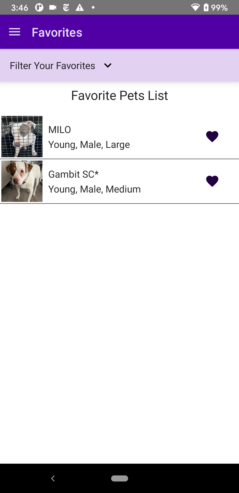
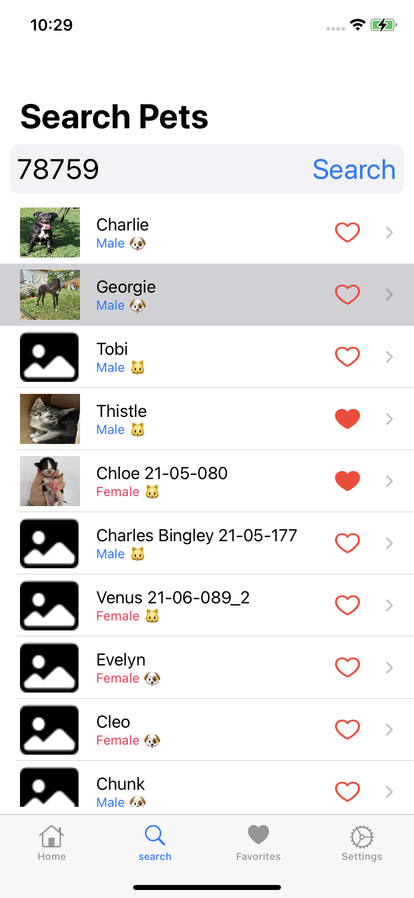

# PetAdoptSampleApp
Sample App created to practice with different iOS/Android Tech
These apps were built to have similar feature sets but to be use Android/iOS tech

## Android

    

## iOS

    

## Disclaimers

Powered by [Petfinder](www.petfinder.com)

Using Petfinder API v2 for sample app:
https://www.petfinder.com/developers/v2/docs/

Icons from: https://icons8.com/
