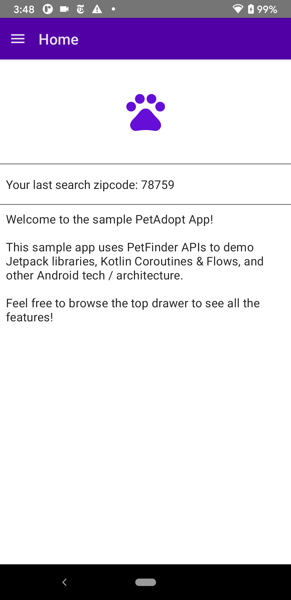
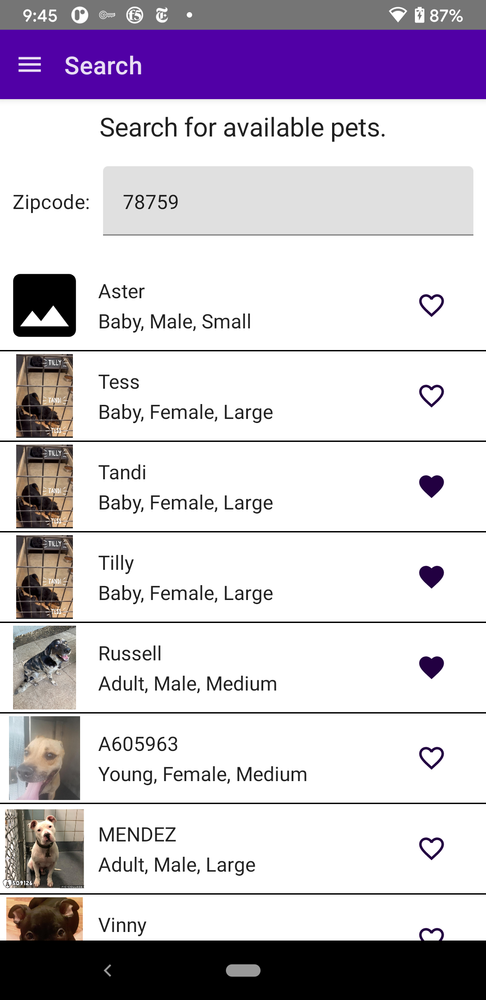
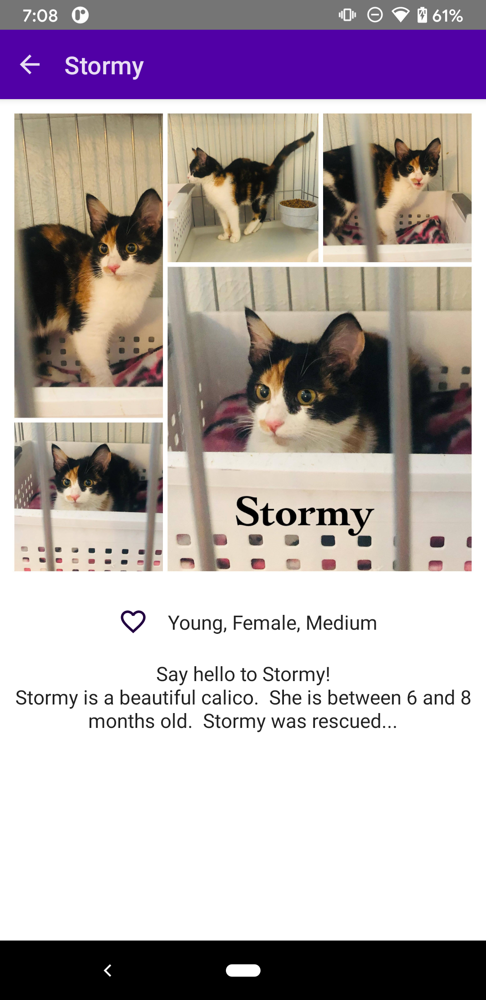

# Android PetAdoptSampleApp
Sample App created to practice with different Android Tech

       

## Android Tech
* Kotlin :heavy_check_mark:
* MVVM :heavy_check_mark:
* ViewModels :heavy_check_mark:
* Room :heavy_check_mark:
* Coroutines :heavy_check_mark:
* Kotlin Flow :heavy_check_mark:
* Jetpack Compose :heavy_check_mark:
* Hilt :heavy_check_mark:
* ViewBinding :heavy_check_mark:

## TODO
* Fix details favorite should update list item

## TODO (Tech)
* Add Jetpack Pages

## TODO (Features)
* More Search Query Filters (Animal type, etc)
* Profile
* Share Animal w/ others
* Dark Mode
* Tablet
* Map? w/ directions
* Onboarding
* Dark Mode
* Accessibility

## Disclaimers

Powered by [Petfinder](www.petfinder.com)

Using Petfinder API v2 for sample app:
https://www.petfinder.com/developers/v2/docs/

Icons from: https://icons8.com/

## Steps to build the app

To build and use this app yourself with the petfinder API,
Follow the [Getting Authenticated](https://www.petfinder.com/developers/v2/docs/) steps on the Petfinder.com website to create an account and API key with access token. 
Copy your client id / secret into the `local.properties` file as:
``` 
client.id=<your client id>
client.secret=<your client secret>
```
These will be used to create your Petfinder API token. 
If you do not have your token set up properly, you will see a warning on the Home screen and Petfinder's functionality will not work until you've set up the app with the client id and secret.


