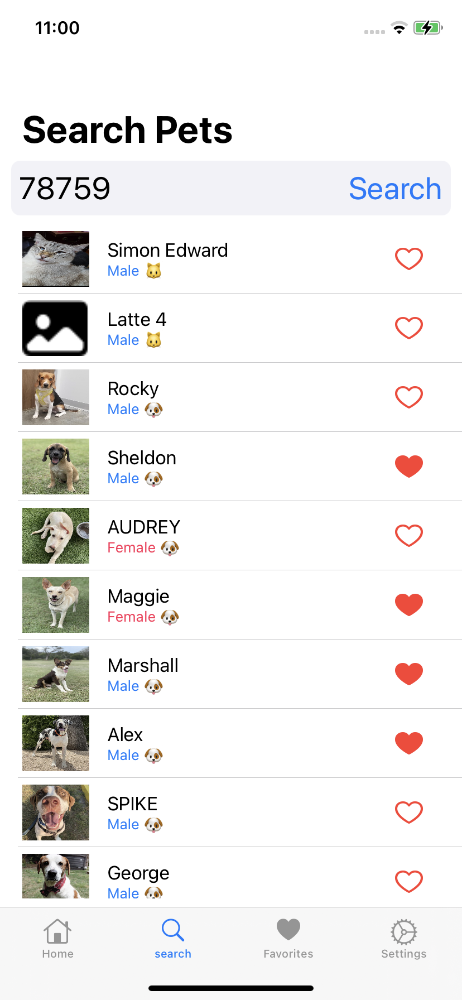

# iOS PetAdoptSampleApp
Sample App created to practice with different iOS Tech

## iOS Tech
* SwiftUI
* Combine
* Cocoapods

## TODO
* Use YapDatabase to make favorites feature
* Make favorites feature
* Separate out a framework

## Future
* Setup similar feature to Android to auto curl the token key
* CoreData
* Async/Await
* AFNetworking
* Resolver (Dependency Injection)

## Disclaimers

Powered by [Petfinder](www.petfinder.com)

Using Petfinder API v2 for sample app:
https://www.petfinder.com/developers/v2/docs/

Icons from: https://icons8.com/

## Steps to build the app

To build and use this app yourself with the petfinder API,
Follow the [Getting Authenticated](https://www.petfinder.com/developers/v2/docs/) steps on the Petfinder.com website to create an account and API key with access token. 
Add your access token to a new file `~/accessTokens/petfinderAccessToken`. This is a hidden file not included with this public repo that will be included in the build steps in order for the app to access the petfinder API.
